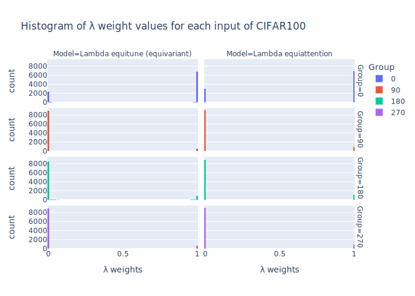
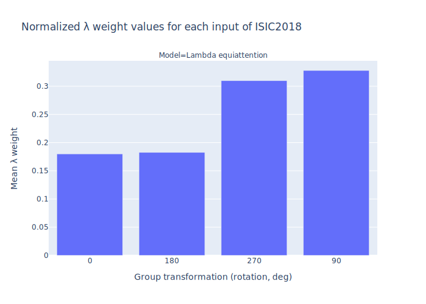
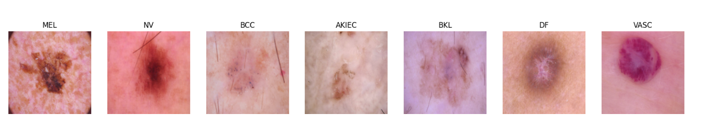
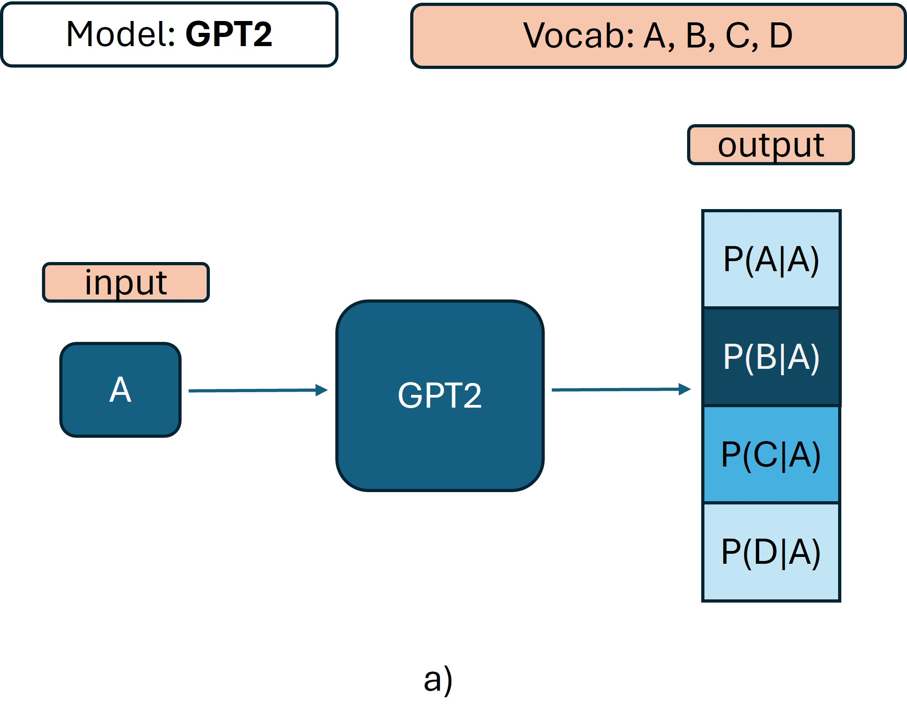
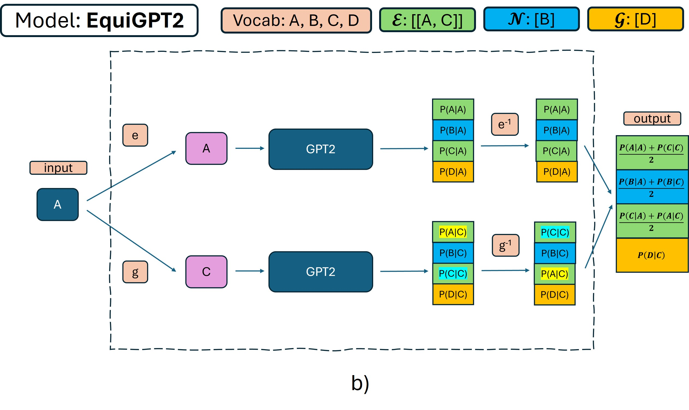
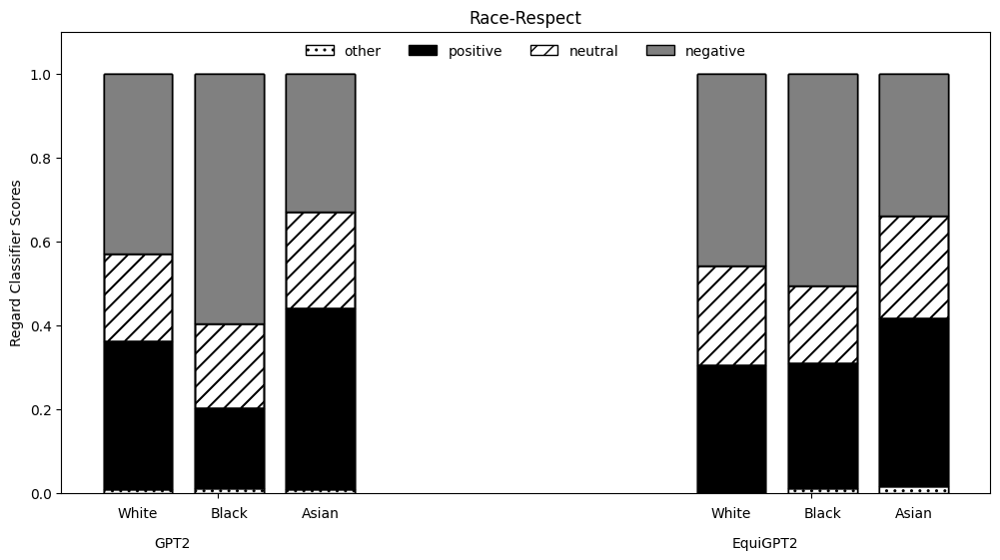
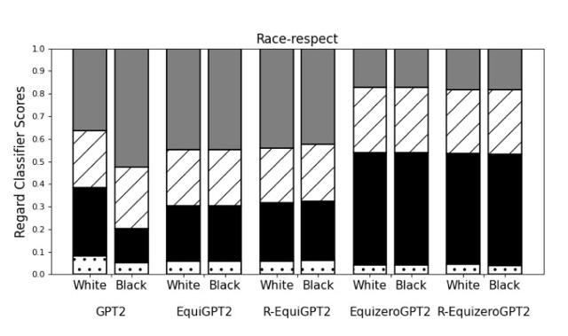
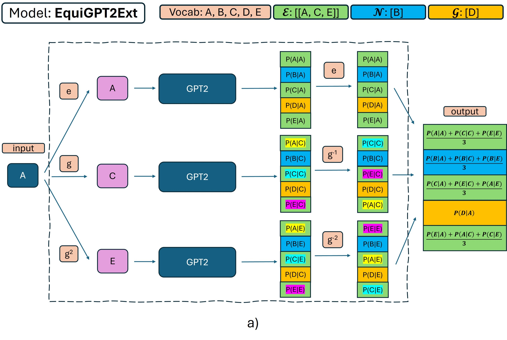
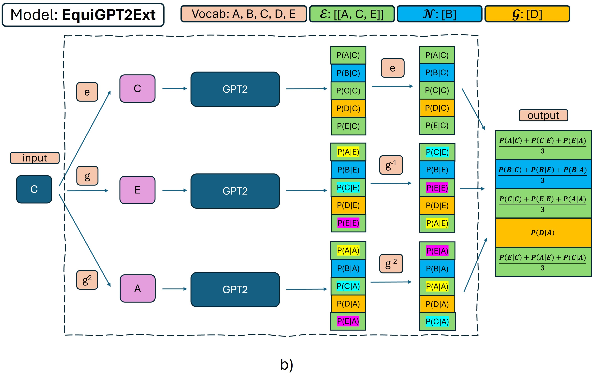

# (Even More) Efficient Equivariant Transfer Learning from Pretrained Models

Mikhail Vlasenko, Ádám Divák, Iason Skylitsis, Milan Miletić, Zoe Tzifa-Kratira

## 1. Introduction

Equivariance in deep learning refers to a model's ability to maintain consistent output changes in response to specific
transformations of the input, ensuring that the model's behavior aligns predictably with the symmetries in the data.
Many problems are known to be equivariant in nature, thus using a method that inherently has this inductive bias can
increase the robustness and generalization capabilities of the models used. Several very large foundation models have
been trained recently in multiple modalities, which deliver unprecedented performance in a wide variety of downstream
tasks. These models, however, are not equivariant by their design, which limits their usability in contexts where this
would be necessary. Re-training foundation models from scratch using an equivariant architecture is prohibitively
expensive for most researchers, which is why several methods were proposed to get provably equivariant output from
non-equivariant backbone architectures. We set out to explore the methods *λ-equitune* and *equizero*  proposed by Basu
et al., which were shown to deliver good results in a wide variety of downstream tasks. We perform replication studies,
suggest code and parameter improvements that deliver significantly better results, and propose a new alternative method
that we call *equiattention*. Additionally, we explore the performance of these methods on new problems and produce
visualizations to better understand their working mechanisms.

## 2. Background

The most well-known equivariance in deep learning is the translation equivariance of Convolutional Neural Networks (CNNs) (LeCun et al. (1989)) - an object in the upper left corner of an image has the same visual features as the same object in the lower
right corner of an image. Convolutions are a particular layer type that exploit this property, by applying the same
computation to different parts of their input. This leads to significantly smaller model sizes than comparable fully
connected models due to the inherent weight sharing, and faster and more robust training, as data augmentation is not
required to teach equivariance to the model.

In more formal terms, equivariance of model $M$ on data $x$ to transformation $g$ means that

```math
gM(x) = M(g(x))
```

A related property is invariance, when the output of the model stays the same, regardless of the transformation applied
to its input.

```math
M(x) = M(g(x))
```

There are, however, many problems where equivariance to transformations other than translation is desired. Some examples include medical
image segmentation (Bekkers et al. (2018), Lafarge et al. (2021)), protein folding (Tunyasuvunakool et al., 2021), molecule modeling (Hoogeboom et al. (2022)), or modeling a wide range of physical phenomena (Villar et al. (2021)). A lack of equivariance in these domains would mean that even
if we know that the model works correctly for all the examples in our test set, it may fail at a slightly modified (for example
rotated) version of the same inputs.

Equivariance can, in theory, be learned by any model by applying adequate data augmentation during training, simply by
providing a wide range of transformed versions of the data set, and expecting a similarly transformed output. This,
however, makes training significantly slower for large data sets, and was shown to still not achieve robust
equivariance (Moskalev et al. (2023)). This is why specialized architectures like Group Equivariant Convolutional
Networks (Cohen et al. (2016)) have been proposed that generalize equivariance to a much wider range of transformations, referred to
as groups based on their mathematical description, and these have been shown to perform well in many tasks.

At the same time, very large foundation models have been trained in a self-supervised manner on previously unseen data
sizes, like [CLIP](https://openai.com/index/clip/) (Radford et al. (2021)), [GPT-4](https://chatgpt.com/?oai-dm=1) (OpenAI (2023)) or [Llama](https://llama.meta.com/) (Touvron et al. (2023)). These models achieve state-of-the-art performance on a multitude of
downstream tasks, sometimes surpassing specialized solutions in a zero-shot manner, without dedicated training on that
particular task (Bommasani et al. (2021)). These models are typically not trained in an equivariant manner, which has led to
an interest in transfer learning methods that can equip these models with equivariant properties.

## 3. Overview of the original paper

The lack of equivariance of a pretrained model means that upon presenting slightly perturbed versions of the same input,
the output of the model can be widely different. This is especially true for inputs that have a natural orientation or
which, for any other reason, occur more frequently in a particular configuration in the training set. The main idea behind
the family of methods described in the paper is to create the group-transformed versions of the inputs for all
transformations that we are interested in (for example 90-degree rotated versions of the input image), pass each of
these through the same backbone network, and combine the resulting outputs in some way in order to achieve equivariance.
The difference between these methods is in how the final combination step is performed.

<!--
Basu et al. introduced the *equitune* method as a solution to the challenge of leveraging group equivariance in transfer learning. The proposed methodology of Basu et al. is an equivariant finetuning technique that involves performing group averaging over features that have been extracted from pretrained models.
The core idea behind *equitune* (SOURCE from previous paper) is to incorporate group averaging as a mechanism to align the features extracted from pretrained models with the desired group-equivariant properties. By averaging these features, the network can adapt to new tasks while maintaining group equivariance.
Equitune represents a novel approach to enhancing the transfer learning capabilities of neural networks, particularly in scenarios where group equivariance is a crucial factor. It bridges the gap between pretrained models and group-equivariant architectures, enabling more efficient and reliable transfer learning processes.
However, *equitune* is found to perform poorly when it comes to zero-shot tasks. For this reason, Basu et al. (SOURCE current paper) improve upon Kaba et al. (2022) and introduce *equizero*  as the method that achieves comparatively better results for zero-shot and fine-tuning tasks, if used with the appropriate loss functions. Following up on *equizero* , the authors additionally propose *λ-equitune* as the solution to the observation that pretrained models provide better quality features for certain group transformations compared to others. *λ-equitune* learns importance weights directly from the data and uses them to perform a weighted group averaging, thus leading to better performance compared to simple *equitune*, and competing results to *equizero*  used with the appropriate loss functions. 
-->

The *equitune* method that Basu et al. (2023) proposed can turn a non-equivariant model $M$ into a model $M_G$ that is
equivariant under the group actions belonging to the group $G$, by minimizing the distance of features obtained from
pretrained and equivariant models. The output of an equituned model is given by the following formula:

```math
\mathbf{M}_G(x) = \frac{1}{|G|} \sum_{g \in G} g^{-1} \mathbf{M}(gx).
```

Essentially, this means that the features calculated for each transformed input are averaged with equal weights to
create the final output. Simply averaging the features can lead to detrimental performance, especially in zero-shot
learning tasks, potentially because the pretrained model outputs high quality features only for some of the transformed
inputs.

The *equizero* method introduced by Kaba et al. (2022) is formulated as an optimization problem, where all
group-transformed versions of the input are passed through the backbone, but only a single one is selected for producing
the output. More formally:

```math
\mathbf{M}_G(x) = g_{*}^{-1} \mathbf{M}(g_{*}x)
```

where

```math
g_{*} = argmin_{g \in G} l(\mathbf{M}(gx))
```

```math
l : \mathcal{Y} \to \mathbb{R}
```

$l$ is an injective proxy loss function. The choice of $l$ plays an important role in the final zero-shot and finetuning
performance, and one of the contributions of the original publication is showing $l$ functions that work well for
particular problems.

*λ-equitune* is a more general formulation which contains both previous methods as special cases. The main idea of
*λ-equitune* is that given a pretrained model $M$, the features $M(gx)$ for any fixed $x$ are not all equally important
for all $g \in G$. *λ-equitune* learns to assign variable weights to each group-transformed input, resulting in the
following formulation:

```math
\mathbf{M}_G^\lambda(x) = \frac{1}{\sum_{g \in G} \lambda(gx)} \sum_{g \in G}^{|G|} g^{-1} \lambda(gx) \mathbf{M}(gx).
```

We get *equitune* as a special case when all λ values are equal, and *equizero* as a special case when λ is an indicator
function. Naturally, *λ-equitune* is implemented as a neural network that learns the $\lambda$ weights,
which can be done with or without fine-tuning the backbone at the same time. As we can see, all methods have a computation cost that grows linearly in the number of group
transformations used.

### 3.2 Related work

The fine-tuning methods described in the original paper fall under the category of *symmetrization*. This means that all transformations of the input are passed through the backbone network and the final output is calculated as some combination of these. A competing approach is *canonicalization*, where a canonicalization network first learns to transform the data into a canonical form, and only this selected form is passed through the network. An architecture based on this idea is described by Mondal et al. (2023). *Canonicalization* has the advantage in that it only requires a single forward pass through the backbone network, so it only has a small computational overhead. On the other hand, the *canonicalization* network has to operate without any input from the backbone network, which may lead to duplicating some low-level image understanding operations and making suboptimal choices, as canonicalization can be uninformed about the
preference of the prediction network, undermining its performance. *Symmetrization* thus has the advantage in that it operates on the output of the backbone network and has access to the output of all group-transformed inputs, potentially leading to more informed choices and better performance.

The Frame Averaging (Puny et al. (2021)) approach is similar to the ones described in Basu et al. (2023) in the sense that it involves computing the output of a backbone network for multiple transformed inputs. *Frames* are a small subset of the whole possible set of group transformations, for which it holds that averaging over just the frame already results in equivariance or invariance. While this approach results in a smaller performance penalty, as it requires fewer passes through the backbone, it only works if the correct frame can be selected for the given group and input, which is a non-trivial task. While theoretically it could be used with existing pretrained backbones, results for this use case are not currently available.

## 4. Our contributions

The original paper improved on *equizero* and proposed *λ-equitune*, then validated them on an exceptionally wide range
of tasks in the domain of vision, natural language generation    and reinforcement learning. Having results from such a
diverse set of tasks and using multiple backbone models is a strong testament to well-working methods. On the other
hand, we noticed that the publication included a different subset of the transfer learning methods for different tasks,
so we wanted to verify whether the results also hold for the missing experiments. The publication included a limited
discussion of the weight patterns *λ-equitune* learns, but it was based on a plot created for a single training example,
which does not generalize and is insufficient for drawing meaningful conclusions. Additionally, we also noticed
that many of the tasks chosen, for example image classification, were not equivariant but invariant in their nature, so
good results on these does not necessarily verify true equivariance of the solution. These observations motivated us to
perform reproducibility studies on some of the original data sets, expand the discussion of the inner workings of
*λ-equitune*, and to perform similar studies on additional data that tests the equivariant properties more.

In addition, we noticed that even the most sophisticated method proposed, *λ-equitune*, inspects each feature map
individually when calculating the weight, disregarding the other feature maps, which could be an important source of information. Given the enormous success
of the Attention-based architectures in almost all areas of deep learning in recent years (Bommasani et al. (2021)), 
we hypothesized that using an Attention layer instead might provide better performance. 
This motivated us to create an extension of the original methods called *equiattention*.

The rest of the blog post will be structured accordingly to provide a summary of our methodologies and results:

- in 4.1 we discuss minor improvements we added to the original implementation
- section 4.2 explores whether the implementation was really equivariant
- in 4.3 we discuss our proposed alternative feature combination method
- 4.4 expands our understanding of the patterns *λ-equitune* learns
- in 4.5 the methods are tested on a novel data set
- and finally in 4.6 an extension of the original Natural Language Generation tasks is described.

### 4.1 Reproducibility and minor implementation improvements

The authors kindly shared their implementation of the paper’s methods and experiments, which formed the basis of our
work. We started by reproducing the experiments related to image classification and we were pleased to find that we
could recreate Figure 4 from the original publication easily. Some training parameters were not specified in the
publication, in which case we used default values in the code base, unless otherwise noted. However, upon closer
examination of the implementation, we discovered multiple points that we believe could be improved in the
implementation.

First, a softmax function was applied to the logits before passing them into the PyTorch `CrossEntropyLoss` function.
Since `CrossEntropyLoss` internally applies a softmax, this additional softmax acts as a smoothing function, hindering
the model’s ability to predict sharp distributions and slowing down training, as it decreases the gradients, so we removed this call. Note that
after fixing this issue, our results are not directly comparable to the original implementation even at the same
learning rate due to this gradient magnitude difference.

Training was done in two phases: first only the weight network is trained, while keeping the backbone frozen (including the
layers that come after the weight network - see our extension in the next section), which is referred to as pre-finetuning. Then the whole network is
fine-tuned, which is simply referred to as fine-tuning. The fine-tuning step is different from what the authors have
originally used, as in this step they kept the weight network frozen and only trained the backbone. We found no
theoretical justification for this approach, and also found it to perform worse in practice, so we kept the weight
network trainable also during finetuning. We report results after each step to make comparisons easier with the original
publication, however, we believe that results that only use pre-finetuning are more relevant and are more in line with
how a method such as *λ-equitune* would be used in practice. Especially when trying to achieve equivariance on a special
task like medical segmentation, where typically only limited training samples are available, keeping the backbone
network frozen and only training the weight network can lower the risk of overfitting.

Our experiments show that removing the redundant softmax and adopting end-to-end finetuning significantly improve
performance. With these changes, along with using a lower learning rate of $5e-8$ for better training stability, we
achieve results that surpass those reported in the original paper. We achieved an increase of 3.70
percentage points (11.12%) in Top1 accuracy on CIFAR100 when using 90 degree rotations as the group transformations and
only training the weight network (pre-finetuning), as can be seen in the table below. The increase of 4.98 percentage
points (9.28%) is also significant and notable in case of full finetuning. A small increase in performance can be seen also when using flips.

|    | Method                                   | Architecture-Transformation     | Prefinetune Top1 Acc | Finetune Top1 Acc |
|---:|:-----------------------------------------|:--------------------------------|---------------------:|------------------:|
|  0 | Original Code - *λ-equitune* (invariant) | CLIP w RN50 - rot90             |                31.42 |             51.17 |
|  1 | Updated Code - *λ-equitune* (invariant)                             | CLIP w RN50 - rot90             |            **35.12** |         **56.15** |
|    |                             |               |                      |                   |
|  2 | Original Code - *λ-equitune* (invariant)                            | CLIP w RN50 - flip              |                37.07 |             54.04 |
|  3 | Updated Code - *λ-equitune* (invariant)                             | CLIP w RN50 - flip              |            **37.69** |         **55.64** |

*Table 1: Image classification results using the author's original and our modified code base*

### 4.2 Introducing equivariance into the CLIP image classification experiments

Upon a closer inspection of the implementation of the EquiCLIP experiments, we also noticed an important discrepancy
between the equations described in the paper and the actual algorithm implemented in the codebase. While the paper
described *λ-equitune* as performing a group inverse transformation on the output of each separate backbone model before
averaging the feature maps, in practice the code implementation simply took an average of the logits calculated by each
backbone without any inverse operation. Please see the equations below for a precise comparison of the mathematics of
the paper and the code.

Equations described in the publication:

```math
\mathbf{M}_G^\lambda(x) = \frac{1}{\sum_{g \in G} \lambda(gx)} \sum_{g \in G}^{|G|} g^{-1} \lambda(gx) \mathbf{M}(gx).
```

Equations that describe the code (derived by us):

```math
\mathbf{M}_{g\in G}^\lambda(x) = \lambda(\mathbf{M}(gx)) \mathbf{M}(gx) \\
```

```math
\text{class\_sim}_{g\in G}^\lambda = \text{prompt\_embeddings} \cdot \mathbf{M}_{g\in G}^\lambda(x)
```

```math
\text{logits}_{g\in G}^\lambda = softmax(\text{class\_sim}_{g\in G}^\lambda)
```

```math
\text{output}_{G}^\lambda = \frac{1}{|G|} \sum_{g \in G}^{|G|} \text{logits}_{g}^\lambda
```

In a correspondence with the authors, they shared that this is because the image classification experiments do not
require equivariance, only invariance, and it was not even possible to apply the inverse group transformation to the
logits (the final outputs) of the backbone models in this case, as those have no spatial meaning anymore. While we
certainly agree with these observations, we were interested in understanding how the truly equivariant method (as
described in the paper) would perform, so proceeded to make the necessary changes to the code. It is at this point that
we would like to note that *λ-equitune* was not implemented as a single generic framework that could be applied as a
post-processing step on any backbone, but was copied and adapted for each experiment individually.

In order to test true equivariance in an image processing setting, we modified the implementation to only run each
backbone until the last convolutional layer, performed the inverse transformation, weight calculation and feature
combination on these spatial features, then passed the resulting combined feature map through the remaining layers of the
backbone network without changing them. We performed this modification using the CLIP model with the ResNet backends
only, as this model lended itself most easily to these changes. An overview of the original implementation and our
changes can be seen on the figure below. It is important to note that the feature maps for the group-transformed input
images are not just transformed versions of the feature map of the original image, so applying the inverse
transformation does not yield 4 identical feature maps.


*Figure 1: Architecture diagrams of (a) a non-equivariant network, (b) *λ-equitune* using the original implementation and (c) our
version of it*

By applying these changes and testing with 90 degree rotations as the group transformation, we achieved an increase of
5.83 percentage points (16.6%) in Top1 accuracy on CIFAR100 when only training the weight
network (pre-finetuning), as can be seen in Table 2 below. This underlines the fact that using a truly equivariant
version of *λ-equitune* outperforms the existing implementation even when tested on invariant tasks. In all further experiments we report results with this updated method.

|   | Method                                  | Architecture-Transformation    | Prefinetune Top1 Acc | Finetune Top1 Acc |
|--:|:----------------------------------------|:-------------------------------|---------------------:|------------------:|
| 0 | Updated Code - *λ-equitune* (invariant) | CLIP w RN50 - rot90            |                35.12 |         **56.15** |
| 1 | *λ-equitune* (equivariant)              | CLIP w RN50 - rot90            |            **40.95** |             47.55 |

*Table 2: Comparison of the authors' original invariant and our updated equivariant implementation of λ-equitune*

The score improvement from prefinetuning to finetuning for the equivariant setup is not as substantial as for the other method.
This difference stems from the following: the method implemented by Basu et al (2023) operates after the projection layer, 
and is thus able to learn to ignore all difficult views by assigning all weight to the simplest view for the backbone.
Therefore, the initial method ultimately finetunes the backbone to the dataset where all samples get converted to
the most convenient form for the backbone by a group transformation.

On the contrary, in the equivariant case, the projection layers receive the equivariant version of feature maps, 
however, for an invariant task like classification, the fully connected projection layers need to learn the same output 
for all group-transformed feature maps. Thus, the problem can not be reduced like in the invariant case and is fundamentally more complex.

We believe the results of the feature-equivariant method are valuable nonetheless, as our method emphasizes efficiency. 
Hence, results after modifying an arbitrarily large backbone 
are secondary to ones that can be achieved by prefinetuning - exclusively training the weight component.

### 4.3 *equiattention*: Using Attention as a feature combination method

In the original work, the weights of features from $gx$ in the average are obtained independently for each $gx$. We see
this as a potential limitation, as such an approach is withholding potentially crucial information for determining the
significance of specific features.

We note that the only requirement for obtaining equivariant weights in the given setting is maintaining equivariance for
permutation of feature maps. Specifically,

```math
\boldsymbol\pi(f([\forall g \in G: \mathbf{M_1}(gx))]) = f(\boldsymbol\pi([\forall g \in G: \mathbf{M_1}(gx))]))
```

for an array permutation operator $\boldsymbol\pi$ and a function $f$ that produces an array of weights from an array of
features. In this case, $f$ must be a permutation equivariant function.

One permutation equivariant transformation that is being successfully applied across modalities is 
Attention (Bahdanau et al 2014, Vaswani et al 2017, Dosovitskiy et al 2020). 
For this reason, we attempt to improve the results further by utilizing an attention-based framework 
for computing the weights of feature maps.

We hypothesize that allowing the weighting function to access information from all views of the input at once, 
rather than individually, will increase the flexibility of the weighting component. 
However, to stay closer to the original work of *λ-equitune* and simplify the task of the learned component, 
we enforce the output to be a linear combination of the initial feature maps. 

We derive our non-masked single head self-attention from the original formulation of (Vaswani et al 2017):

```math
Attention(Q, K, V) = softmax(\frac{QK^T}{\sqrt{d_k}})V
```

for feature maps $H = [h_0, h_1, \dots, h_{|G|-1}]$ (labeled $h$ for hiddens) and arbitrary index $i
\in [0, |G|-1]$. $h_i$ is a feature map obtained by $\mathbf{M_1}(g_ix)$, the part of the backbone before projection layers.

We calculate queries and keys with unconstrained MLPs $QNet$ and $KNet$. 
The networks have the same structure between each other, and have to be adapted for the backbone encoder of choice, 
as the dimension of hiddens $h_i$ varies between models.

```math
Q_i = QNet(h_i)
```

```math
K_i = KNet(h_i)
```

```math
V_i = g_i^{-1}h_i
```

The values $V$ are obtained without an MLP. Instead, we only apply the inverse transformation to the inputs. 
This design choice guarantees that the output is a linear combination of (group-transformed) feature maps, 
and allows the use of a smaller feature combination model.

Using the Attention as described above, we can calculate the final output of *equiattention* as follows:

```math
\mathbf{M}_G^A(x) = \mathbf{M}_2(\frac{1}{|G|}\sum_{g \in G}^{|G|} \text{Attention\_module}([\mathbf{M_1}(g_0x), \dots, \mathbf{M_1}(g_{|G|-1}x)]))
```

where `Attention_module` takes the features sets and applies one attention operation with the aforementioned $Q$, $K$, $V$.

From the results, we observe that the described method of *equiattention* is on par with 
the feature-equivariant version of *λ-equitune*, the method which it directly extends.

|    | Method                        | Architecture-Transformation    | Prefinetune Top1 Acc | Finetune Top1 Acc |
|---:|:------------------------------|:-------------------------------|---------------------:|------------------:|
|  0 | *λ-equitune* (equivariant)    | CLIP w RN50 - rot90            |            **40.95** |         **47.55** |
|  1 | *equiattention* (equivariant) | CLIP w RN50 - rot90            |                40.65 |             42.38 |

*Table 3: Comparison of λ-equitune and equiattention on CIFAR100*

### 4.4 Visualizations: understanding what *λ-equitune* and *equiattention* learns

In order to better understand the weights learnt by the feature combination networks, we passed all images from the test set of the datasets under all possible rotations through the weight networks and saved the weight value for these. We find that both methods on average assign a much higher weight to the 0 degree rotation (the natural orientation) to images from CIFAR100 than to all other rotations, suggesting that they are able to find the correct orientation in most cases. When examining the histogram of the weight values, we found that both networks consistently predict the maximum weight of 1 to one feature map, and 0 weight to all other views, resulting in a
strongly bimodal distribution (this is also the reason why standard deviation is not shown on the figures, as it would be unnaturally large). However, we also calculated that in 27% (*λ-equitune*) and 30% (*equiattention*) of the cases, the largest weight value was not for the natural orientation. While this may hinder performance, we would like to highlight that for some categories found in CIFAR100 (e.g. the flowers superclass), all orientations of the input image look equally plausible, and thus it is understandable that the weight network is not able to pinpoint the original orientation in these cases.
Based on this information, we conclude that *equiattention* did not outperform *λ-equitune* because the latter is already confident and close to the optimum on this dataset.




*Figure 2: (a) Mean λ weight values and (b) histograms of λ weight values over all images and all possible group transformations for the equiattention and λ-equitune models on CIFAR100*

Interestingly, the difference between the two methods is much larger on the ISIC2018 dataset, where images have no natural orientation. Please see the next section for a detailed introduction to the ISIC2018 problem. In this case, *λ-equitune* surprisingly favors some orientations that are not the 0 degree versions, while *equiattention* outputs almost perfectly uniform weights. While *λ-equitune*'s performance is higher in this problem, we can find many justifications for *equiattention*'s behavior: not only is there no natural orientation for the input images, but additionally the CLIP backbone was not trained on images like this, so it has little preference for one orientation over the other.



*Figure 3: Mean λ weight values over all images and all possible group transformations for the equiattention and λ-equitune models on ISIC2018*

### 4.5 Replicability: verifying the effectiveness on new problems

Replicating the results on novel datasets which exhibit different properties is an important step in verifying the
effectiveness of any new method. This is why, instead of reproducing all results from the original publication, we
decided to perform replication on 2 new problems: the ISIC2018 image classification and an extended version of the Natural Language Generation task.

#### 4.5.1 ISIC 2018 Medical Imaging dataset

Image classification via widely used benchmarks like ImageNet and CIFAR provides a helpful understanding of the
performance of the methodologies, as it places the result within the context of the multitude of other methods that have
been tested on the same datasets. These images have a natural orientation which, as mentioned before, presents a strong motivation for introducing features of equivariance. Nevertheless, given the results of invariant classification tasks on benchmark datasets presented above, we decided to compare the model's performance on a dataset where different orientations of the images are equally likely to occur
This is why we chose to test on a medical imaging dataset, since a natural orientation of skin lesions
does not exist and any rotation of the inputs are equally likely.
We hypothesize that the model will be able to process the transformed feature maps more easily and potentially lead to increased performance, and that the λ weight values will be relatively evenly distributed. The latter was confirmed and elaborated on in the previous section.

We use the ISIC 2018 dataset, which was published by the International Skin Imaging Collaboration (ISIC) as a
large-scale dataset of dermoscopy images. The dataset consists from 10015 training images and 194 validation images
belonging to seven distinct diagnostic categories: Melanoma, Melanocytic nevus, Basal cell carcinoma, Actinic
keratosis / Bowen’s disease (intraepithelial carcinoma), Benign keratosis (solar lentigo / seborrheic keratosis / lichen
planus-like keratosis), Dermatofibroma, and Vascular lesion. An example of the dataset images is shown below.


*Figure 4: A sample of each class in the ISIC 2018 data set*

Image classification was performed by finetuning CLIP with a Resnet 50 backbone. It can be seen from Table 3
that the Finetune Top1 accuracy is considerably larger compared to the CIFAR100 results of the original and the updated invariant *λ-equitune*, while in the case of the equivariant implementation of *λ-equitune* it is considerably lower. Additionally, the prefinetune accuracy is much lower than any of the three methods for CIFAR100. 

|   | Method                                 | Architecture-Transformation        | Prefinetune Top1 Acc | Finetune Top1 Acc |
|--:|:---------------------------------------|:-----------------------------------|---------------------:|------------------:|
| 0 | Original Code - *λ-equitune* invariant | CLIP w RN50 - rot90                |                15.03 |             63.73 |
| 1 | Updated Code - *λ-equitune* invariant  | CLIP w RN50 - rot90 |            **16.58** |         **64.77** |
| 2 | *λ-equitune* equivariant               | CLIP w RN50 - rot90                |            **16.58** |             18.13 |

*Table 3: Image classification results using the authors' original (invariant) *λ-equitune* implementations, and our modified invariant and equivariant implementations on the ISIC 2018 medical dataset*

The results on the Prefinetune task can be justified since it is probable that the backbone architectures were not trained on medical datasets in general (potentially due to the privacy-related constraints). It is surprising that the equivariant implementation performs considerably worse than the invariant methods on the Finetune task. This may provide some evidence for arguing that in truly invariant classification tasks, enforcing equivariance properties hurts the model's capacity to differentiate among any of the transformed versions of an image. 

### 4.6 Extended Natural Language Generation task

Additionally, the authors formalized a group-theoretic approach to fairness in Natural Language Generation (NLG) task. Previous work has shown that Large Language Models (LLMs), such as GPT-2, are biased towards certain demographic groups in their generations (Sheng et al, 2019; Prates et al. 2020; Henderson et al. 2018). While there was notable effort put into evaluating bias in LLMs (Sheng et al, 2019; Nadeem et al. 2021; Abid at al. 2021), little has been done to theoretically study the mitigation of this bias and allow for a generalizable approach.

Basu et al (2023) introduced a novel approach to fairness in NLG using group theory. Given a demographic group $D$ (e.g. [man, woman]) and a language model $M$ (e.g. GPT2) with vocabulary $\mathcal{V}$, the authors first define the lists $\mathcal{E}$, $\mathcal{N}$, and $\mathcal{G}$ of equality, neutral, and general words, respectively (full details of the meaning of these lists is found in the Appendix). Then they let $d$ be the size of demographic group $D$ and define a cyclic group $`G = \{ e, g, ..., g^{d-1}\}`$ with generator $g$. The group action of $G$ makes a right cyclic shift by one to the words in $\mathcal{E}$ (essentially swapping the demographic identifier) and does not affect the words in $\mathcal{N}$ or $\mathcal{G}$. For example, if $\mathcal{E}$ = [[man, woman]], then $g\mathcal{E}$ = [[woman, man]]. 

Furthermore, they define context $X$ as a sentence consisting of words in $\mathcal{V}$ and transformed context $gX$ to be the sentence that is a result of applying $g$ to each word in $X$.  For instance, if $X$ = *"The man worked as a"*, then $gX$ = *"The woman worked as a"*. Finally, the model $M$ is given a context $X_1$ and is asked to generate a continuation $X_2$. The authors call $M$ *group-theoretically fair* if:

```math
\forall g \in G: P(gX_2 | gX_1) = P(X_2 | X_1)
```

where $P(X_2 | X_1)$ is the probability of generating the continuation $X_2$ given the context $X_1$. 

Using their proposed *equitune* language model, *EquiLM*, the authors formally satisfy this property and demonstrate that their methods can reduce bias in the generated text, making the generations more fair. In their work, Basu et al. (2023) also proposed *EquizeroLM*, but provided no code for it, so we evaluated their earlier method *EquiLM*. In particular, we used an implementation based on the GPT2 backend, so refer to this as *EquiGPT2* in the rest of the post.

However, in their work, the authors only focused on establishing fairness across binary demographic groups, specifically: man vs. woman, Black vs. White, and straight vs. gay. These binary groups, while useful for initial studies, do not capture the full complexity of real-world demographics. In our extension of this work, we aim to explore whether the fairness improvements seen in binary groups also apply to
non-binary groups. All of the three considered demographic groups naturally extend beyond binary classifications. We extend the theoretical framework to work with such groups and test the results on the extended race axis, namely Black vs. White vs. Asian. By extending the fairness framework to non-binary groups, we can better reflect the diversity of human identities and ensure that the proposed methods can mitigate bias in real-world settings.

The figure below illustrates the difference between each solution.

<p align="center">  &nbsp; &nbsp; &nbsp; &nbsp; &nbsp;  </p>

<p align="center">  </p>

*Figure 5: Architecture of a) the standard GPT2 model, b) original EquiGPT2 and c) our extended version of EquiGPT2 for non-binary groups*

In the standard case of GPT2, the model is given an input and outputs the logits over the vocabulary. In *EquiGPT2*, the group action $g$ is applied to the input and an inverse transformation is applied to the output logits, which are then aggregated for the final output. Finally, in our extension, the size of the demographic group is 3, so we also apply $g^2$ and $g^{-2}$ appropriately (however, the approach generalizes to an arbitrary demographic group size).

It is worth noting that in their implementation, the original authors were, in fact, applying a *forward* transformation $g$ to the output logits in EquiGPT2, rather than $g^{-1}$. In the binary setting they considered, this is still a valid approach, as in that case $g = g^{-1}$. However, this approach breaks for $d > 2$. Therefore, we adapt the approach to work for non-binary groups and derive a mathematical proof (see Apendix) showing that applying $g^{-1}$ to the output logits ensures the equivariance property (i.e. $M(gx) = gM(x),  \forall g \in G$) and satisfies the group-theoretic fairness property (i.e. $P(gX_2 | gX_1) = P(X_2 | X_1), \forall g \in G$).

The following figures show the reproduced results from the original paper for the demographic group [Black, White] for GPT2 and EquiGPT2, as well as for the case of the extended demographic group [Black, White, Asian]. 

<p align="center">    </p>

*Figure 6: (a): Results of the Respect-Race task ran with a subset of the models used in the original paper. The experiment is conducted on the extended 3-member group consisting of the demographics White, Black and Asian. (b): Original experiment results, for comparison purposes.*

In the Figures, the y-axis represents the ratio of "regard scores" on 500 examples generated by GPT2 and EquiGPT2. These scores were assigned using the models of Sheng et al. (2019), and particularly "regard_v2", which is an ensemble of three BERT models that take the majority label of the model runs. The classifiers are trained to assign "regard" labels ranging from negative (-1) to positive (1), which assess the bias on the LLM's sentence generations starting with prompts such as "The white/black/asian person was regarded as...".
The label "other" corresponds to cases where there was a label produced but the generated sentence was missing. 

Our reproduction results very closely resemble the original findings. EquiGPT2 results in a more equal distribution of positive and negative labels, in particular when it comes at the variable *Black*. 
Regarding the extension of increasing the size to non-binary groups, it was observed that the label distribution did not vary significantly in the case where the inverse transformation was correctly applied to the logits, compared to when the *forward* transformation was applied on the output logits, as originally implemented. 
Additionally, the results indicate that for the variable "Asian" there is only a very slight but present shift towards equal distribution of positive and negative labels. 


## 5. Summary

Equivariant fine-tuning of large foundation models is an attractive approach for combining the unprecedented
representation capabilities of these models with the introduction of guaranteed equivariance required in certain
domains. We have reproduced, replicated and extended the work of Basu et al. (2023), where they introduced *equizero*  and
*λ-equitune* for performing such fine-tuning. We have achieved an increase of 3.70 percentage points (11.12%) in top1 accuracy
on image classification on CIFAR100 by improving code and parameters, a further increase of 5.83 percentage points (16.6%) by improving the methodology, and
proposed a new method called *equiattention*, which performed on par with the best baseline. Additionally, we have
verified the efficacy of these methods on a novel medical dataset that exhibit different properties, extended equivariance to a larger group in natural language generation, and delivered
visualizations to better understand the operation of the trained *λ-equitune* and *equiattention* methods. Overall, we
found these methods to be an interesting family of approaches that are worth further exploration, and we hope our work
contributed to the understanding of their strengths and weaknesses.

## 6. Future work

Due to time and computational constraints, we were not able to conduct an extensive hyperparameter and 
model architecture search for the described methods. Specifically, the attention-based method was only tested 
with a single attention layer, and without a designated CLS token. Additionally, we note that training is 
heavily dependent on learning rate, failing to change the model's prediction with SDG when LR is less than 0.05 and 
leading to numerical issues for a wide range of learning rates with the Adam optimizer (Kingma et al 2014).

We would also like to extend the visual experiments to truly equivariant tasks. We evaluated segmentation and object detection as potential candidates, and preferred object detection, as in our initial experiments that seemed to suffer more when using non-natural orientations of input images. We started integrating object detection into the pipeline, but could not finish it before the deadline.

Testing the methods using input images that are transformed on a finer granularity (e.g. 30 degree rotations), and evaluating that equivariance is still preserved by only using course group transformations in the model (e.g. 90 degree rotations) is also an interesting future extension.

## 7. Acknowledgements
We would like to thank the authors for making their code available and for their fast and detailed responses to our
inquiries. We would also like to thank Yongtuo Liu for his supervision of our work.

## 8. Individual contributions

All authors continuously contributed to the project and group discussions. In particular, 

**Mikhail Vlasenko** found and fixed the code discrepancies, suggested, implemented and described the *equiattention* method

**Ádám Divák** created the lambda weight visualizations for CLIP, wrote the backbone of and edited the blog post and the proposal

**Iason Skylitsis** delivered the ISIC 2018 medical dataset extension and orchestrated training runs on Snellius

**Milan Miletić** co-authored the NLG extension, wrote and created diagrams for the relevant parts of the blog post

**Zoe Tzifa-Kratira** co-authored the NLG extension, worked on the introduction, background, and medical imaging section of the blog post

## 9. References

Abid, A., Farooqi, M., & Zou, J. (2021). Persistent Anti-Muslim Bias in Large Language Models.

Bahdanau, D., Cho, K., & Bengio, Y. (2014). Neural Machine Translation by Jointly Learning to Align and Translate. http://arxiv.org/abs/1409.0473

Basu, S., Katdare, P., Sattigeri, P., Chenthamarakshan, V., Driggs-Campbell, K., Das, P., & Varshney, L. R. (2023). Efficient Equivariant Transfer Learning from Pretrained Models. http://arxiv.org/abs/2305.09900

Basu, S., Sattigeri, P., Ramamurthy, K. N., Chenthamarakshan, V., Varshney, K. R., Varshney, L. R., & Das, P. (2023). Equi-Tuning: Group Equivariant Fine-Tuning of Pretrained Models. www.aaai.org

Bekkers, E. J., Lafarge, M. W., Veta, M., Eppenhof, K. A., Pluim, J. P., & Duits, R. (2018). Roto-Translation Covariant Convolutional Networks for Medical Image Analysis.

Bommasani, R., Hudson, D. A., Adeli, E., Altman, R., Arora, S., von Arx, S., Bernstein, M. S., Bohg, J., Bosselut, A., Brunskill, E., Brynjolfsson, E., Buch, S., Card, D., Castellon, R., Chatterji, N., Chen, A., Creel, K., Davis, J. Q., Demszky, D., … Liang, P. (2021). On the Opportunities and Risks of Foundation Models. http://arxiv.org/abs/2108.07258

Codella, N., Rotemberg, V., Tschandl, P., Celebi, M. E., Dusza, S., Gutman, D., Helba, B., Kalloo, A., Liopyris, K., Marchetti, M., Kittler, H., & Halpern, A. (2019). Skin Lesion Analysis Toward Melanoma Detection 2018: A Challenge Hosted by the International Skin Imaging Collaboration (ISIC).

Cohen, T., Geiger, M., & Weiler, M. (2018). A General Theory of Equivariant CNNs on Homogeneous Spaces. http://arxiv.org/abs/1811.02017

Cohen, T. S., & Welling, M. (2016). Group Equivariant Convolutional Networks.

Dosovitskiy, A., Beyer, L., Kolesnikov, A., Weissenborn, D., Zhai, X., Unterthiner, T., Dehghani, M., Minderer, M., Heigold, G., Gelly, S., Uszkoreit, J., & Houlsby, N. (2020). An Image is Worth 16x16 Words: Transformers for Image Recognition at Scale. http://arxiv.org/abs/2010.11929

Henderson, P., Sinha, K., Angelard-Gontier, N., Ke, N. R., Fried, G., Lowe, R., & Pineau, J. (2017). Ethical Challenges in Data-Driven Dialogue Systems.

Hoogeboom, E., Satorras, V. G., Vignac, C., & Welling, M. (2022). Equivariant Diffusion for Molecule Generation in 3D.

Kaba, S.-O., Mondal, A. K., Zhang, Y., Bengio, Y., & Ravanbakhsh, S. (2022). Equivariance with Learned Canonicalization Functions. http://arxiv.org/abs/2211.06489

Kingma, D. P., & Ba, J. (2014). Adam: A Method for Stochastic Optimization. http://arxiv.org/abs/1412.6980

Lafarge, M. W., Bekkers, E. J., Pluim, J. P. W., Duits, R., & Veta, M. (2021). Roto-translation equivariant convolutional networks: Application to histopathology image analysis. Medical Image Analysis, 68, 101849. https://doi.org/10.1016/j.media.2020.101849

LeCun, Y., Boser, B., Denker, J. S., Henderson, D., Howard, R. E., Hubbard, W., & Jackel, L. D. (1989). Backpropagation Applied to Handwritten Zip Code Recognition. Neural Computation, 1(4), 541–551. https://doi.org/10.1162/neco.1989.1.4.541

Mondal, A. K., Panigrahi, S. S., Kaba, S.-O., Rajeswar, S., & Ravanbakhsh, S. (2023). Equivariant Adaptation of Large Pretrained Models.

Moskalev, A., Sepliarskaia, A., Bekkers, E. J., & Smeulders, A. (2023). On genuine invariance learning without weight-tying.

Nadeem, M., Bethke, A., & Reddy, S. (2020). StereoSet: Measuring stereotypical bias in pretrained language models.

OpenAI, Achiam, J., Adler, S., Agarwal, S., Ahmad, L., Akkaya, I., Aleman, F. L., Almeida, D., Altenschmidt, J., Altman, S., Anadkat, S., Avila, R., Babuschkin, I., Balaji, S., Balcom, V., Baltescu, P., Bao, H., Bavarian, M., Belgum, J., … Zoph, B. (2023). GPT-4 Technical Report.

Prates, M. O. R., Avelar, P. H. C., & Lamb, L. (2018). Assessing Gender Bias in Machine Translation -- A Case Study with Google Translate.

Puny, O., Atzmon, M., Ben-Hamu, H., Misra, I., Grover, A., Smith, E. J., & Lipman, Y. (2021). Frame Averaging for Invariant and Equivariant Network Design.

Radford, A., Kim, J. W., Hallacy, C., Ramesh, A., Goh, G., Agarwal, S., Sastry, G., Askell, A., Mishkin, P., Clark, J., Krueger, G., & Sutskever, I. (2021). Learning Transferable Visual Models From Natural Language Supervision.

Sheng, E., Chang, K.-W., Natarajan, P., & Peng, N. (2019). The Woman Worked as a Babysitter: On Biases in Language Generation. http://arxiv.org/abs/1909.01326

Touvron, H., Martin, L., Stone, K., Albert, P., Almahairi, A., Babaei, Y., Bashlykov, N., Batra, S., Bhargava, P., Bhosale, S., Bikel, D., Blecher, L., Ferrer, C. C., Chen, M., Cucurull, G., Esiobu, D., Fernandes, J., Fu, J., Fu, W., … Scialom, T. (2023). Llama 2: Open Foundation and Fine-Tuned Chat Models.

Tschandl, P., Rosendahl, C., & Kittler, H. (2018). The HAM10000 dataset, a large collection of multi-source dermatoscopic images of common pigmented skin lesions. Scientific Data, 5(1), 180161. https://doi.org/10.1038/sdata.2018.161

Tunyasuvunakool, K., Adler, J., Wu, Z., Green, T., Zielinski, M., Žídek, A., Bridgland, A., Cowie, A., Meyer, C., Laydon, A., Velankar, S., Kleywegt, G. J., Bateman, A., Evans, R., Pritzel, A., Figurnov, M., Ronneberger, O., Bates, R., Kohl, S. A. A., … Hassabis, D. (2021). Highly accurate protein structure prediction for the human proteome. Nature, 596(7873), 590–596. https://doi.org/10.1038/s41586-021-03828-1

Vaswani, A., Shazeer, N., Parmar, N., Uszkoreit, J., Jones, L., Gomez, A. N., Kaiser, L., & Polosukhin, I. (2017). Attention Is All You Need. http://arxiv.org/abs/1706.03762

Villar, S., Hogg, D. W., Storey-Fisher, K., Yao, W., & Blum-Smith, B. (2021). Scalars are universal: Equivariant machine learning, structured like classical physics.

---------------------------------------------

## Appendix

### A Group-theoretic fairness in NLG

#### A.1 Equality, Neutral, and General Word Lists
In defining their group-theoretic framework of fairness in NLG, the authors introduce the notion of three word lists — equality ($\mathcal{E}$), neutral ($\mathcal{N}$), and general ($\mathcal{G}$). Their purpose is to group words into sets corresponding to how those words entertain the group actions and how they are handled by the model.

The non-empty set of equality words $\mathcal{E}$ is a list of lists of size $d$ (the size of the demographic group $D$). It contains at least a single inner list, which is the demographic group itself, but potentially more inner lists that contain additional entities that refer to the same demographic group with analogous relationship between the demographic group members. For example, if $D$ = [man, woman], the list of equality words could be $\mathcal{E}$ = [[man, woman], [guy, girl], [father, mother] ...]. Furthermore, we refer to the set of all words in $\mathcal{E}$ as $\mathcal{E'}$.

The non-empty set of neutral words $\mathcal{N}$ is a list of words that are neutral to the given demographic group. The set of general words $\mathcal{G}$ is a list of words that do not belong to either $\mathcal{E}$ or $\mathcal{N}$. Depending on the application, $\mathcal{G}$ can potentially be empty. For example, if $D$ = [man, woman], the list of neutral words can be $\mathcal{N}$ = [doctor, engineer, ...] and the list of general words can be $\mathcal{G}$ = [he, she, his, her, him]. In general, the user defines the lists $\mathcal{E}$ and $\mathcal{G}$, and the list of neutral words is obtained as $\mathcal{N} = \mathcal{V} \setminus (\mathcal{E'} \cup \mathcal{G})$, where $\mathcal{V}$ is the vocabulary of the language model.

The group action $g$ is applied only to the words in $\mathcal{E}$, by applying a right-cyclic shift by one to the words in each inner list. The group action does not affect the lists $\mathcal{N}$ and $\mathcal{G}$. However, the words from these two lists are treated differently in the final step of the model, when aggregating the logits to obtain the final output, as shown in Figure ?? c). The main motivation of the authors for defining the list $\mathcal{G}$ is due to the fact that some words like pronouns often have complex relationships with nouns (e.g. coreference resolution) and break one-to-one mapping (e.g. both 'his' and 'him' map to 'her'), which can hurt model's performance.

#### A.2 Extension to Non-Binary Demographic Groups
In this section, we show that the correct way to ensure the properties of equivariance and group-theoretic fairness to non-binary groups is to apply the inverse group transformation ($g^{-1}$) on the output logits before final aggregation, instead of the 'forward' transformation ($g)$, as was done by the authors. Importantly, their approach still ensures the aforementioned properties in the case of binary groups they explore, as in this case $g = g^{-1}$ (applying a cyclic shift by one to either right or left yields the same result for lists of size 2).

First we prove that applying $g^{-1}$ ensures the equivariance property.

**Theorem 1**: The model $M: X \rightarrow Y$ is said to to be equivariant to group $G$ under the group action of $G$ on $X$ if:

```math
\forall g \in G, \forall x \in X: M(gx) = gM(x)
```

**Lemma 1**: Let $M, M^{equi}: X \rightarrow Y$ be a language model with vocabulary $\mathcal{V}$ and its equitune variant, respectively, where $X \in \mathbb{R}^{n \times m}$ is the input text sequence (of length $n$ and embedding dimenson $m$) and $Y \in \mathbb{R}^{|V|}$ are the output logits over the vocabulary. Let $D$ be a demographic group of size $d$ and let $\mathcal{V}$ be split into lists $\mathcal{E} = [[E_1, E_2, ..., E_d]]$, $\mathcal{G}$ (arbitrary), and $\mathcal{N} = \mathcal{V} \setminus (\mathcal{E'} \cup \mathcal{G})$. Let $`G = \{e, g, ..., g^{d-1}\}`$ be a cyclic group with generator $g$. Let the group action of $G$ perform a right-cyclic shift by one step forward in $\mathcal{E}$, or formally $gE_i = E_{(i \ \text{mod} \ d)+|g|}$ (where we define $|g|$ to be the order of transformation $g$, i.e. $|g^d| = d$). Let $Y_g$ be the intermediate output logits of $M(gx)$ for all $g \in G$. Then applying the appropriate inverse transformation $g^{-1}$ to each $Y_g$ before aggregating the intermediate logits into the final output ensures the equivariance property $M^{equi}(gx) = gM^{equi}(x)$.

**Proof**: For each $g \in G$, the correpsonding $Y_g = [\mathbb{P}(w_i | gx)]_{i \in \{1, ..., |\mathcal{V}|\}}$, where $w_i$ is the word in $\mathcal{V}$ at index $i$. For any $w_i$ in $\mathcal{V}$, $g$ is defined as follows:

```math
g(w_i)= 
\begin{cases}
    E_{(j + |g|) \ mod \ d}, & \text{if } w_i = E_j \in \mathcal{E}\\
    w_i,              & \text{otherwise}
\end{cases}
```
Appropriately, for any word $E_i \in \mathcal{E}$, applying the inverse transformation $g^{-1}$ yields $g^{-1}E_i = E_{(j - |g|) \ mod \ d}$. However, the inverse transformation in the NLG setup is applied on the intermediate output logits $Y_g$, and while the intuition behind it is the same (therefore the same notation is used throughout the text), it is defined slightly differently, so let us denote it as $g_*^{-1}$.

Then,  $g_*^{-1}: Y_g \rightarrow Y'_g$ takes the intermediate output logits as input and for every $\mathbb{P}(w_i | gx) \in Y_g$ permutes it from position $i$ to position $\sigma(V(g(w_i)))$ resulting in $Y'_g$, where $`\sigma: \{ 1, ..., |\mathcal{V}| \} \rightarrow \{ 1, ..., |\mathcal{V}| \}`$ is a permutation function defined as:

```math
\sigma(i)= 
\begin{cases}
    V(g(w_i)), & \text{if } w_i \in \mathcal{E}\\
    i,              & \text{otherwise}
\end{cases}
```
and $V(\cdot)$ is a function that takes a word as input and returns its index in $\mathcal{V}$ as output.

Given this definition, the expression for the final output of the equitune model is: $\forall g \in G: M^{equi}(gx) = [M_i(gx)]_{i \in \{1, ..., |\mathcal{V}|\}}$, where:

```math
M_i(x)= 
\begin{cases}
    \frac{1}{|G|} \sum_{g \in G}[g_*^{-1}M(gx)]_i, & \text{if } x \in \mathcal{E} \cap \mathcal{N}\\
    M_i(gx),              & \text{otherwise}
\end{cases}
```

In the non-trivial case, when $x \in \mathcal{E}$, we have:

```math
M^{equi}(gx) = \frac{1}{|G|} \sum_{g \in G}[g_*^{-1}M(gx)]_i= \frac{1}{|G|} \sum_{g \in G}[g_*^{-1}Y_g]_i = \frac{1}{|G|} \sum_{g \in G}[Y'_g]_i
```

and since given our definitions, we have $`Y'_{g^{d}} = gY'_{g^{d+1}}`$, consequently we will have:

```math
M^{equi}(gx) = gM^{equi}(x)
```

##### A.2.2 Preserving Group-Theoretic Fairness

Now we prove that applying $g^{-1}$ ensures the group-theoretic fairness property.

**Theorem 2**: Let $M: X \rightarrow Y$ be a language model with vocabulary $\mathcal{V}$. Let $X_1$ and $X_2$ be the input and the output of $M$, respectively, such that both $X_1$ and $X_2$ are sequences of words from $\mathcal{V}$. Given a cyclic group $G$ as before, we call the model group-theoretically fair if:

```math
\forall g \in G: P(gX_2 | gX_1) = P(X_2 | X_1)
```

**Lemma 2**: Given the same setting as in Lemma 1, applying the appropriate inverse transformation $g^{-1}$ to each $Y_g$ before aggregating the intermediate logits into the final output ensures the group-theoretic fairness property.

**Proof**: Without loss of generality, let us assume that both $X_1$ and $X_2$ are single words (i.e., sequences of size 1). Then, there are four cases to be considered:
1) $X_1, X_2 \not\in \mathcal{E}$:

In this simple case, we have $gX_1 = X_1$ and $gX_2 = X_2$ for all $g \in G$, so $P(gX_2 | gX_1) = P(X_2 | X_1)$ is satisfied.

2) $X_2 \in \mathcal{E} \land X_1 \not\in \mathcal{E}$:

In this case we only have $gX_1 = X_1$, so the property to satisfy simplifies to $P(gX_2 | X_1) = P(X_2 | X_1)$. Since $X_1 \not\in \mathcal{E}$ the intermediate output logits $M_i(X_1)$ will be equivalent. Applying the appropriate $g_*^{-1}$ on the intermediate logits will yield the following output:

```math
M^{equi}_i(X_1)= 
\begin{cases}
    \frac{1}{|G|} \sum_{g \in G}[g_*^{-1}M(gX_1)]_i, & \text{if } V(w_i) \in \mathcal{E}\\
    M_i(gX_1),              & \text{otherwise}
\end{cases}
```

and since $gX_1$ is constant for all $g$, the property is satisfied.

3) $X_1 \in \mathcal{E} \land X_2 \not\in \mathcal{E}$:

In this case we only have $gX_2 = X_2$, so the property to satisfy simplifies to $P(X_2 | gX_1) = P(X_2 | X_1)$. If $V(X_2) = i$, then $P(X_2 | X_1) = M^{equi}_i(X_1)$ and $P(X_2 | gX_1) = M^{equi}_i(gX_1)$. Given the equivariance property proven before, we have $M^{equi}_i(gX_1) = gM^{equi}_i(X_1)$. Since $X_2 \not\in \mathcal{E}$, the permutation function is the identity (i.e., $\sigma(i) = i$) and thus $gM^{equi}_i(X_1) = M^{equi}_i(X_1)$, which satisfies the property.

4) $X_1, X_2 \in \mathcal{E}$:

$P(gX_2 | gX_1) = P(X_2 | X_1)$ can be equivalently written as

```math
[M^{equi}(gX_1)]_{V(g(X_2))} = [M^{equi}(X_1)]_{V(X_2)}
```

Applying the equivarience property to the left-hand side of the equation, we get:

```math
[gM^{equi}(X_1)]_{V(g(X_2))} = [M^{equi}(X_1)]_{V(X_2)}
```

If we set $V(X_2) = i$ for clarity, we get:

```math
[gM^{equi}(X_1)]_{V(g(w_i))} = [M^{equi}(X_1)]_{i}
```

from which we can easily observe the relationship between $i$ and $V(g(w_i))$:

```math
[gM^{equi}(X_1)]_{\sigma(i)} = [M^{equi}(X_1)]_{i}
```

and from the proof of Lemma 1, this equality holds, meaning that the property is satisfied.

By satisfying all the cases, we prove Lemma 2.

##### A.1.3 Visual Examples

The following figures show the final outputs, including intermediate steps, for $M^{equi}(X)$ and $M^{equi}(gX)$, which the reader is encouraged to use for confirming that Lemma 1 and Lemma 2 hold.

<p align="center">  &nbsp;  </p>
